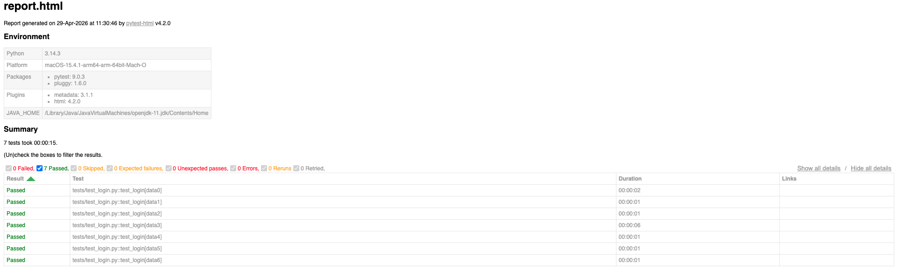
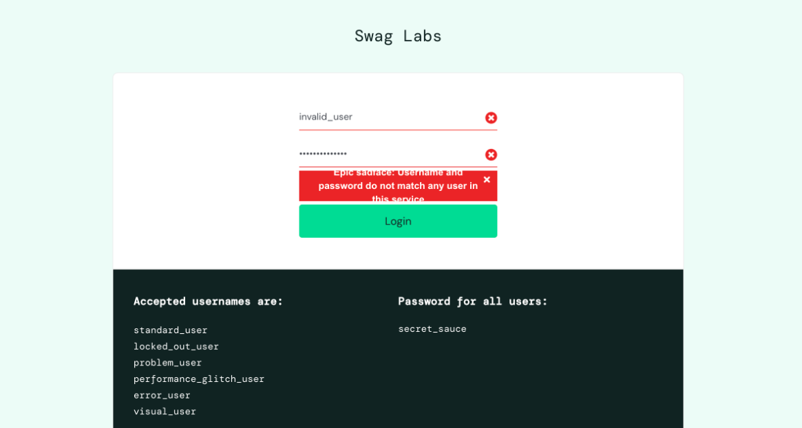
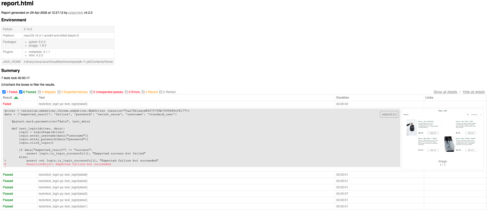

# Selenium + Pytest Data-Driven Automation Framework (Excel-Based)

## Overview

This project is a **data-driven test automation framework** built using **Python, Selenium WebDriver, and Pytest**.
It automates login functionality using **Excel-based test data**, enabling efficient validation of both **positive and negative test scenarios**.

The framework is designed following **industry best practices** such as the **Page Object Model (POM)** and reusable utilities.
---

## Key Features

* Data-Driven Testing using Excel (Pandas)
* Page Object Model (POM) design pattern
* Supports positive & negative login test scenarios
* Reusable utility functions for test data handling
* Pytest-based test execution and assertions
* Generates detailed test execution reports using pytest-html
* Capture screenshots on test failures
* Clean and modular project structure
* Easy to extend for additional test cases
  
---

## Tech Stack

* **Programming Language:** Python
* **Automation Tool:** Selenium WebDriver
* **Test Framework:** Pytest
* **Data Handling:** Pandas (Excel)
* **Design Pattern:** Page Object Model (POM)

---

## Project Structure

excel-selenium-pytest-framework/
│
├── tests/
│   └── test_login.py
│
├── pages/
│   └── login_page.py
│
├── utils/
│   └── excel_reader.py
│
├── test_data/
│   └── login_data.xlsx
│
├── conftest.py
├── requirements.txt
└── README.md

---

### How to Run the Tests

### Clone the repository

git clone https://github.com/aishwarya-muralidhar/excel-selenium-pytest-framework.git
cd excel-selenium-pytest-framework

### Create virtual environment

python -m venv venv
source venv/bin/activate   # Mac/Linux

### Install dependencies

pip install -r requirements.txt

### Run tests

pytest -v

---

## Test Scenarios Covered

* Valid login credentials (Positive Test)
* Invalid username/password (Negative Test)
* Empty input fields
  
---

## Sample Test Execution

> Example:

================== test session starts ==================
collected 7 items

tests/test_login.py .....                        [100%]

================== 7 passed in 6.21s ==================

---

## Test Reports

**HTML Test Report**
This framework generates a detailed HTML test report using pytest-html, providing insights into:
 * Test execution status (Pass/Fail)
 * Execution time
 * Test summary dashboard

**Generate Report**
pytest --html=reports/report.html --self-contained-html

**Screenshot on Failure**
The framework automatically captures screenshots whenever a test case fails.
 * Screenshots are saved in the reports/screenshots directory

---

## Author

**Aishwarya M**
QA Engineer | Automation Enthusiast

---

## 🔗 GitHub Repository

👉 https://github.com/aishwarya-muralidhar/excel-selenium-pytest-framework
